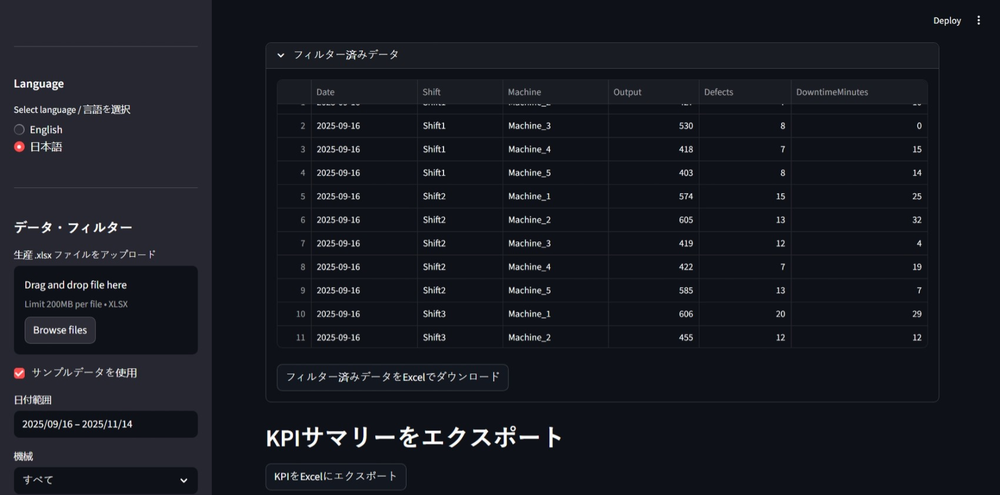

# Production KPI Dashboard – VBA から Python への移行

### Dashboard View


### Data Visualization


### Filtered Data


概要

このリポジトリは、Excel の VBA ベースの KPI レポーティングツールを Streamlit を用いたモダンな Python ウェブアプリへ移行した例を示します。製造業の現場で使われる内部ダッシュボードを模し、生産管理、品質管理、運用報告のユースケースを想定しています。

特徴

- レガシーな Excel VBA による自動化（VBA モジュールを同梱）
- モジュール化された Streamlit ベースの Python アプリ
- ファイルアップロード（.xlsx）とサンプルデータ生成スクリプト
- フィルター（期間、機械、シフト）
- KPI カード、チャート（matplotlib）、データテーブル、エクスポート機能
- 英語／日本語のバイリンガル対応（サイドバーの言語切替）


VBA 版の実行方法

1. `production_data` シートを含む Excel ブックを開き、以下の VBA モジュールをインポートします:
   - `ProductionKPITool.bas`
   - `Helpers.bas`
   - `UserForm.frm`（VBA エディタにインポートするか、同等のフォームを作成してください）
2. ワークブックに `production_data` と `kpi_dashboard` という名前のシートが存在することを確認します。
3. `RunProductionKPI` マクロを実行するか、ボタンに割り当てて実行します。

Python 版の実行方法

必要条件

- Python 3.9+（3.10 推奨）
- 仮想環境の作成と有効化

依存パッケージのインストール（PowerShell の例）:

```powershell
python -m venv .venv; .venv\Scripts\Activate.ps1; pip install -U pip
pip install pandas streamlit matplotlib openpyxl
```

サンプルデータの生成（任意だが推奨）:

```powershell
python python_app/data/generate_sample_data.py
```

Streamlit アプリの起動:

```powershell
cd python_app
streamlit run app.py
```

アプリが起動したら、サイドバー上部の言語セレクタで英語（English）または日本語（日本語）を選択できます。切り替えは即時反映されます。

プロジェクト構成

```
/project-root
    README.md
    README.ja.md          # 本ファイル（日本語訳）
    /vba
        ProductionKPITool.bas
        UserForm.frm
        Helpers.bas
    /python_app
        app.py
        compute_kpis.py
        charts.py
        data_loader.py
        styles.css
        /data
            sample_production_data.xlsx (generate_sample_data.py で生成)
```

KPI の計算式（説明）

- 総生産量（Total Output）: フィルターされたレコードの `Output` の合計。
- 不良率（Defect Rate）: 総不良数 / 総生産量（パーセンテージ表示）。
- 設備稼働率（Machine Utilization）: 100 - (総ダウンタイム分数 / (シフト分数 * シフト数)) * 100。
  - `shift_minutes` はデフォルトで 480 分（8 時間）を想定。
  - `shifts` はフィルタ済みデータの行数（各行がシフト単位の記録である想定）で近似。
- 効率スコア（Efficiency Score）: Output / (Output + Defects)

ユースケース（製造業向け）

このダッシュボードは生産管理者や品質管理担当者向けで、次の用途を想定しています：

- 機械やシフトごとの日次生産量の監視
- 不良トレンドの追跡と問題機械の特定
- ダウンタイムによる稼働時間ロスの推定
- KPI サマリをエクスポートして報告・会計へ連携

セットアップおよび開発ノート

- Python アプリはモジュール化されています: `data_loader.py`, `compute_kpis.py`, `charts.py`。
- スタイルは `python_app/styles.css` にまとめられ、Streamlit 実行時に注入されます。
- サンプルデータ生成スクリプト `python_app/data/generate_sample_data.py` を実行すると、現実的なサンプルデータが作成されます。

今後の改善案

- ユーザー認証とロールベースのアクセス制御の追加
- データをデータベースに永続化し、履歴比較を可能にする機能
- シフト表に基づくより正確な稼働率計算
- インタラクティブなチャート（Plotly）やドリルダウン機能の追加
- KPI 計算ロジックのユニットテスト追加

ライセンス

MIT License

---

ご不明点や追加の翻訳要望があれば教えてください。